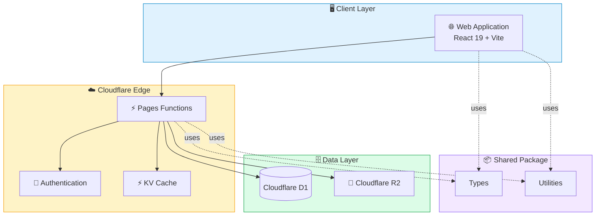

# 🚀 SIMKEMAS

> **Enterprise Resource Planning (ERP)** & **Point of Sales (POS)** untuk **Pusat Layanan Kemasan UMKM**

<p align="center">


</p>

---

## Daftar Isi

- [Tentang SIMKEMAS](#-tentang-simkemas)
- [Preview](#️-preview)
- [Modul Utama](#-modul-utama)
- [Dashboard](#-dashboard)
- [Keamanan](#-keamanan)
- [Arsitektur Sistem](#️-arsitektur-sistem)
- [Workflow Produksi](#-workflow-produksi)
- [Tech Stack](#️-tech-stack)
- [Struktur Project](#-struktur-project)
- [REST API](#-rest-api)
- [Environment Variables](#️-environment-variables)
- [Quick Start](#-quick-start)
- [Deployment](#-deployment)
- [Roadmap](#-roadmap)
- [Kontribusi](#-kontribusi)
- [Lisensi](#-lisensi)

---

## ✨ Tentang SIMKEMAS

SIMKEMAS merupakan platform **Enterprise Resource Planning (ERP)** dan **Point of Sales (POS)** yang dirancang khusus untuk **Pusat Layanan Kemasan UMKM**.

Platform ini mengintegrasikan seluruh proses bisnis dalam satu sistem, mulai dari **pemesanan pelanggan**, **workflow produksi lintas divisi**, **manajemen keuangan**, hingga **dashboard analitik** secara real-time.

### 🎯 Fitur Unggulan

- 🚀 ERP & POS dalam satu platform
- 🏭 Workflow Produksi Multi Divisi
- 📦 Manajemen Pesanan (SPK)
- 👥 Customer Management
- 💰 Manajemen Keuangan
- 📊 Dashboard Analitik Real-time
- 🔐 Role Based Access Control (RBAC)
- ☁️ Cloudflare Serverless Architecture

---

## 🖥️ Preview

> 🚧 Coming Soon.

---

## 📦 Modul Utama

### 🛒 Point of Sales (POS)

- Pembuatan SPK
- Data Pelanggan
- Data Produk Kemasan
- Pembayaran DP
- Pelunasan
- Cicilan
- Cetak Invoice
- Riwayat Transaksi

### 🎨 Workflow Produksi

Menggunakan konsep **Kanban Workflow**.

```text
POS
 │
 ▼
Desain
 │
 ▼
Produksi
 │
 ▼
Packaging
 │
 ▼
Ready Pickup
```

#### 🎨 Divisi Desain
- Drag & Drop Workflow
- Approval Desain
- Upload File

#### 🖨️ Divisi Produksi
- Monitoring Produksi
- Validasi Material
- Status Mesin

#### 📦 Divisi Packaging
- Quality Control
- Packing
- Ready Pickup

---

## 📊 Dashboard

Dashboard menyediakan informasi bisnis secara real-time, meliputi:

- 📈 Omzet
- 📦 SPK Aktif
- 👥 Data Pelanggan
- 💰 Cashflow
- ⭐ Produk Terlaris
- 📄 Export CSV

---

## 🔒 Keamanan

| Fitur                             | Status |
| ---------------------------------- | :----: |
| Role Based Access Control (RBAC)  |   ✅   |
| Audit Log                          |   ✅   |
| Permission Management              |   ✅   |
| Secure Authentication              |   ✅   |

---

## 🏗️ Arsitektur Sistem



---

## 🔄 Workflow Produksi


---

## ⚙️ Tech Stack

| Layer          | Teknologi                  |
| -------------- | --------------------------- |
| Frontend       | React 19                    |
| Build Tool     | Vite 7                      |
| Styling        | Tailwind CSS v4              |
| Backend        | Cloudflare Pages Functions   |
| Database       | Cloudflare D1                |
| Object Storage | Cloudflare R2                |
| Cache          | Cloudflare KV                 |
| Icons          | Lucide React                   |
| Drag & Drop    | Hello Pangea DnD                |
| Architecture   | Monorepo (npm Workspaces)        |

---

## 📁 Struktur Project

```text
📦 SIMKEMAS
│
├── 🌐 frontend
│   └── React 19 + Vite + Tailwind CSS
│
├── ⚡ backend
│   └── functions
│       ├── _lib
│       └── api
│
├── 🔗 shared
│   └── src
│
├── 📄 package.json
├── 📄 README.md
├── 📄 LICENSE
└── 📄 .gitignore
```

> **Catatan:** Folder `backend` tidak termasuk dalam **npm workspace** karena tidak memiliki dependency Node.js. Seluruh fungsi dijalankan langsung menggunakan **Cloudflare Pages Functions** melalui `wrangler`.

---

## 🔌 REST API

Seluruh endpoint menggunakan prefix `/api`.

### Authentication

| Method | Endpoint       | Deskripsi          |
| ------ | -------------- | ------------------- |
| POST   | `/auth/login`  | Login pengguna      |
| POST   | `/auth/logout` | Logout               |
| GET    | `/auth/me`     | Informasi pengguna   |

### Customers

| Method | Endpoint          |
| ------ | ------------------ |
| GET    | `/customers`        |
| POST   | `/customers`         |
| PUT    | `/customers/:id`      |
| DELETE | `/customers/:id`       |

### Orders (SPK)

| Method | Endpoint       |
| ------ | --------------- |
| GET    | `/orders`        |
| POST   | `/orders`         |
| GET    | `/orders/:id`       |
| PUT    | `/orders/:id`        |

### Production

| Method | Endpoint                  |
| ------ | --------------------------- |
| GET    | `/production`                |
| PUT    | `/production/:id/status`      |

### Finance

| Method | Endpoint      |
| ------ | -------------- |
| GET    | `/payments`     |
| POST   | `/payments`      |
| GET    | `/cashflow`       |

> Seluruh endpoint mengembalikan response dalam format JSON.

---

## ⚙️ Environment Variables

### Frontend (`frontend/.env`)

```env
VITE_API_URL=http://localhost:8788
```

### Backend (`backend/.dev.vars`)

```env
JWT_SECRET=your-secret-key
JWT_EXPIRES_IN=7d
DB_NAME=simkemas
R2_BUCKET=simkemas-files
KV_NAMESPACE=simkemas-cache
```

> Jangan pernah meng-commit file `.env` maupun `.dev.vars` ke repository. Gunakan `.env.example` sebagai template konfigurasi untuk developer baru.

---

## 🚀 Quick Start

### Clone Repository

```bash
git clone https://github.com/viabdillah/simkemas.git
cd simkemas
```

### Install dependency (root + frontend workspace)

```bash
npm install
```

### Jalankan development server

Butuh 2 terminal terpisah:

**Terminal 1 — Frontend (Vite)**
```bash
cd frontend
npm run dev
```
→ http://localhost:5173

**Terminal 2 — Backend (Cloudflare Pages Functions)**
```bash
cd backend
wrangler pages dev functions --port 8788
```
→ http://localhost:8788

> 💡 Frontend memanggil API backend melalui proxy yang dikonfigurasi di `vite.config.js` (`/api` → backend lokal atau URL backend production, tergantung environment).

---

## 📦 Deployment

### Frontend

Deploy menggunakan **Cloudflare Pages**.

```bash
npm run build
```

Output build: `frontend/dist`

### Backend

Deploy menggunakan **Wrangler**.

```bash
cd backend
wrangler deploy
```

### Database

Membuat database Cloudflare D1:

```bash
wrangler d1 create simkemas
```

Migrasi database:

```bash
wrangler d1 migrations apply simkemas
```

### Storage

Membuat bucket Cloudflare R2:

```bash
wrangler r2 bucket create simkemas-files
```

### Cache

Membuat namespace KV:

```bash
wrangler kv namespace create CACHE
```

### Production Architecture

```text
Browser
    │
    ▼
Cloudflare Pages
    │
    ▼
Pages Functions
    │
 ┌──┴───────────┐
 ▼              ▼
Cloudflare D1  Cloudflare R2
       │
       ▼
Cloudflare KV
```

---

## 📈 Roadmap

| Status | Modul                  |
| :----: | ----------------------- |
|   ✅   | Point of Sales           |
|   ✅   | Workflow Produksi         |
|   ✅   | Dashboard                   |
|   ✅   | Manajemen Keuangan            |
|   ✅   | Export CSV                      |
|   🚧   | WhatsApp Notification              |
|   🚧   | Dashboard Mobile                     |
|   🚧   | QR Code                                |
|   🚧   | Multi Cabang                             |
|   🚧   | Cloud Backup                               |
|   🚧   | AI Analytics                                 |

---

## 🤝 Kontribusi

Kontribusi sangat terbuka.

```text
Fork
 │
 ▼
Create Branch
 │
 ▼
Commit Changes
 │
 ▼
Push Branch
 │
 ▼
Pull Request
```

---

## 📜 Lisensi

Project ini menggunakan **MIT License**.

---

## ⭐ SIMKEMAS

**ERP • POS • Workflow Produksi • Dashboard Analytics**

Dibangun menggunakan **React**, **Cloudflare Pages Functions**, dan **Tailwind CSS**.

**© 2026 Divi Abdillah Almasrur**


