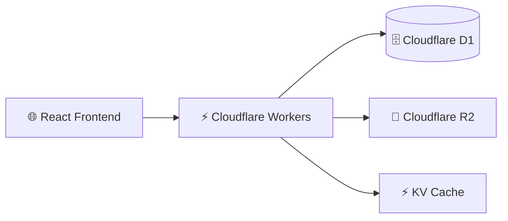

<div align="center">


# 🚀 SIMKEMAS

### Enterprise Resource Planning (ERP) & Point of Sales untuk Pusat Layanan Kemasan UMKM

<p>


</p>

</div>

---

# ✨ Tentang SIMKEMAS

SIMKEMAS adalah platform **Enterprise Resource Planning (ERP)** sekaligus **Point of Sales (POS)** yang dirancang khusus untuk **Pusat Layanan Kemasan UMKM**.

Sistem ini mengintegrasikan seluruh proses bisnis mulai dari **pemesanan pelanggan**, **workflow produksi lintas divisi**, **manajemen keuangan**, hingga **dashboard analitik** dalam satu platform berbasis cloud.

## 🎯 Keunggulan

- 🚀 ERP & POS dalam satu aplikasi
- 🏭 Workflow Produksi Multi Divisi
- 📊 Dashboard Analitik Real-time
- 💰 Manajemen Keuangan
- 📦 Manajemen Pesanan
- 👥 Customer Management
- 🔐 Role Based Access Control (RBAC)
- ☁️ Cloudflare Serverless Architecture

---

# 🖥️ Preview

> Ganti gambar berikut dengan screenshot aplikasi Anda.

<p align="center">


</p>

---

# 📦 Modul Utama

## 🛒 Point of Sales

- Pembuatan SPK
- Data Pelanggan
- Data Produk Kemasan
- Pembayaran DP
- Pelunasan
- Cicilan
- Cetak Invoice
- Riwayat Transaksi

---

## 🎨 Workflow Produksi

Menggunakan konsep **Kanban Workflow**.

```text
POS
 │
 ▼
Desain
 │
 ▼
Produksi
 │
 ▼
Packaging
 │
 ▼
Ready Pickup
```

### Divisi

🎨 Desain

- Drag & Drop
- Approval
- Upload File

🖨️ Produksi

- Monitoring Produksi
- Validasi Material
- Status Mesin

📦 Packaging

- Quality Control
- Packing
- Ready Pickup

---

# 📊 Dashboard

Dashboard menyediakan informasi bisnis secara real-time.

- 📈 Omzet
- 📦 SPK Aktif
- 👥 Data Pelanggan
- 💰 Cashflow
- ⭐ Produk Terlaris
- 📄 Export CSV

---

# 🔒 Keamanan

| Fitur | Status |
|-------|--------|
| Role Based Access Control | ✅ |
| Audit Log | ✅ |
| Permission Management | ✅ |
| Secure Authentication | ✅ |

---

# 🏗️ Arsitektur Sistem



---

# 🔄 Workflow Produksi


---

# ⚙️ Tech Stack

| Layer | Technology |
|---------|-----------------------------|
| Frontend | React 19 |
| Build Tool | Vite 7 |
| Styling | Tailwind CSS v4 |
| Backend | Cloudflare Workers |
| Database | Cloudflare D1 |
| Storage | Cloudflare R2 |
| Cache | Cloudflare KV |
| Icons | Lucide React |
| Workflow | Hello Pangea DnD |
| Architecture | Monorepo |

---

# 📁 Struktur Project

```text
📦 SIMKEMAS
│
├── 📁 apps
│   ├── 🌐 frontend
│   └── ⚡ backend
│
├── 📁 packages
│
├── 📁 docs
│   └── 🖼️ images
│
├── 📄 package.json
├── 📄 wrangler.jsonc
├── 📄 vite.config.ts
├── 📄 README.md
└── 📄 LICENSE
```

---

# 🚀 Quick Start

## Clone Repository

```bash
git clone https://github.com/viabdillah/simkemas.git
```

Masuk ke folder project

```bash
cd simkemas
```

Install dependency

```bash
npm install
```

Jalankan development server

```bash
npm run dev
```

Frontend

```
http://localhost:5173
```

Backend

```
Cloudflare Workers (Wrangler)
```

---

# 📈 Roadmap

| Status | Modul |
|---------|---------------------------|
| ✅ | Point of Sales |
| ✅ | Workflow Produksi |
| ✅ | Dashboard |
| ✅ | Keuangan |
| ✅ | Export CSV |
| 🚧 | WhatsApp Notification |
| 🚧 | Dashboard Mobile |
| 🚧 | QR Code |
| 🚧 | Multi Cabang |
| 🚧 | Backup Cloud |
| 🚧 | AI Analytics |

---

# 🤝 Kontribusi

Kontribusi sangat terbuka.

```text
Fork
   │
   ▼
Create Branch
   │
   ▼
Commit Changes
   │
   ▼
Push Branch
   │
   ▼
Pull Request
```

---

# 📜 Lisensi

Project ini menggunakan lisensi **MIT License**.

---

<div align="center">

### ⭐ SIMKEMAS

ERP • POS • Workflow Produksi • Dashboard Analytics

Dibangun menggunakan **React**, **Cloudflare Workers**, dan **Tailwind CSS**.

<br>

**© 2026 Divi Abdillah Almasrur**


</div>
