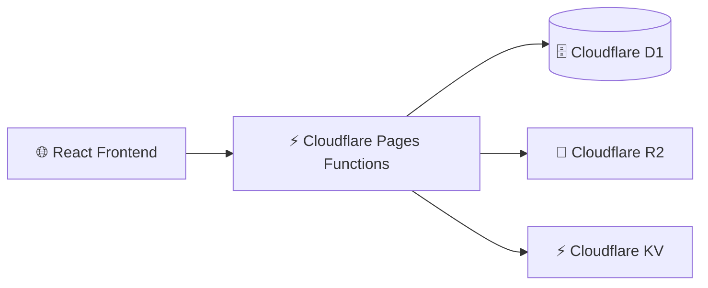

# 

# 🚀 SIMKEMAS

> **Enterprise Resource Planning (ERP)** & **Point of Sales (POS)** untuk **Pusat Layanan Kemasan UMKM**

<p align="center">


</p>

---

## ✨ Tentang SIMKEMAS

SIMKEMAS merupakan platform **Enterprise Resource Planning (ERP)** dan **Point of Sales (POS)** yang dirancang khusus untuk **Pusat Layanan Kemasan UMKM**.

Platform ini mengintegrasikan seluruh proses bisnis dalam satu sistem, mulai dari **pemesanan pelanggan**, **workflow produksi lintas divisi**, **manajemen keuangan**, hingga **dashboard analitik** secara real-time.

### 🎯 Fitur Unggulan

* 🚀 ERP & POS dalam satu platform
* 🏭 Workflow Produksi Multi Divisi
* 📦 Manajemen Pesanan (SPK)
* 👥 Customer Management
* 💰 Manajemen Keuangan
* 📊 Dashboard Analitik Real-time
* 🔐 Role Based Access Control (RBAC)
* ☁️ Cloudflare Serverless Architecture

---

## 🖥️ Preview

> 🚧 Coming Soon.

---

## 📦 Modul Utama

### 🛒 Point of Sales (POS)

* Pembuatan SPK
* Data Pelanggan
* Data Produk Kemasan
* Pembayaran DP
* Pelunasan
* Cicilan
* Cetak Invoice
* Riwayat Transaksi

### 🎨 Workflow Produksi

Menggunakan konsep **Kanban Workflow**.

```text
POS
 │
 ▼
Desain
 │
 ▼
Produksi
 │
 ▼
Packaging
 │
 ▼
Ready Pickup
```

#### 🎨 Divisi Desain

* Drag & Drop Workflow
* Approval Desain
* Upload File

#### 🖨️ Divisi Produksi

* Monitoring Produksi
* Validasi Material
* Status Mesin

#### 📦 Divisi Packaging

* Quality Control
* Packing
* Ready Pickup

---

## 📊 Dashboard

Dashboard menyediakan informasi bisnis secara real-time, meliputi:

* 📈 Omzet
* 📦 SPK Aktif
* 👥 Data Pelanggan
* 💰 Cashflow
* ⭐ Produk Terlaris
* 📄 Export CSV

---

## 🔒 Keamanan

| Fitur                            | Status |
| -------------------------------- | :----: |
| Role Based Access Control (RBAC) |    ✅   |
| Audit Log                        |    ✅   |
| Permission Management            |    ✅   |
| Secure Authentication            |    ✅   |

---

## 🏗️ Arsitektur Sistem



---

## 🔄 Workflow Produksi


---

## ⚙️ Tech Stack

| Layer          | Teknologi                  |
| -------------- | -------------------------- |
| Frontend       | React 19                   |
| Build Tool     | Vite 7                     |
| Styling        | Tailwind CSS v4            |
| Backend        | Cloudflare Pages Functions |
| Database       | Cloudflare D1              |
| Object Storage | Cloudflare R2              |
| Cache          | Cloudflare KV              |
| Icons          | Lucide React               |
| Drag & Drop    | Hello Pangea DnD           |
| Architecture   | Monorepo (npm Workspaces)  |

---

## 📁 Struktur Project

```text
📦 SIMKEMAS
│
├── 🌐 frontend
│   └── React 19 + Vite + Tailwind CSS
│
├── ⚡ backend
│   └── functions
│       ├── _lib
│       └── api
│
├── 🔗 shared
│   └── src
│
├── 📄 package.json
├── 📄 README.md
├── 📄 LICENSE
└── 📄 .gitignore
```

> **Catatan**
>
> Folder `backend` tidak termasuk dalam **npm workspace** karena tidak memiliki dependency Node.js. Seluruh fungsi dijalankan langsung menggunakan **Cloudflare Pages Functions** melalui `wrangler`.

---

## 🚀 Quick Start

### Clone Repository

```bash
git clone https://github.com/viabdillah/simkemas.git
cd simkemas
```

### Install Dependency

```bash
npm install
```

### Menjalankan Development Server

Jalankan dua terminal secara bersamaan.

#### Terminal 1 — Frontend

```bash
cd frontend
npm run dev
```

Frontend tersedia di:

```text
http://localhost:5173
```

#### Terminal 2 — Backend

```bash
cd backend
wrangler pages dev functions --port 8788
```

Backend tersedia di:

```text
http://localhost:8788
```

> 💡 Frontend mengakses backend melalui proxy yang dikonfigurasi pada `vite.config.js`, sehingga request ke `/api` akan diteruskan ke backend lokal maupun production sesuai environment.

---

## 📈 Roadmap

| Status | Modul                 |
| :----: | --------------------- |
|    ✅   | Point of Sales        |
|    ✅   | Workflow Produksi     |
|    ✅   | Dashboard             |
|    ✅   | Manajemen Keuangan    |
|    ✅   | Export CSV            |
|   🚧   | WhatsApp Notification |
|   🚧   | Dashboard Mobile      |
|   🚧   | QR Code               |
|   🚧   | Multi Cabang          |
|   🚧   | Cloud Backup          |
|   🚧   | AI Analytics          |

---

## 🤝 Kontribusi

Kontribusi sangat terbuka.

```text
Fork
 │
 ▼
Create Branch
 │
 ▼
Commit Changes
 │
 ▼
Push Branch
 │
 ▼
Pull Request
```

---

## 📜 Lisensi

Project ini menggunakan **MIT License**.

---

## ⭐ SIMKEMAS

**ERP • POS • Workflow Produksi • Dashboard Analytics**

Dibangun menggunakan **React**, **Cloudflare Workers**, dan **Tailwind CSS**.

**© 2026 Divi Abdillah Almasrur**


