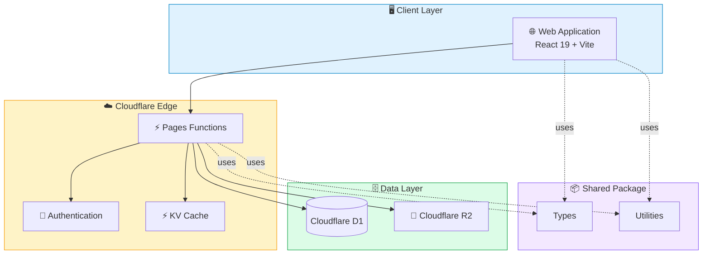

# 

# 🚀 SIMKEMAS

> **Enterprise Resource Planning (ERP)** & **Point of Sales (POS)** untuk **Pusat Layanan Kemasan UMKM**

```md

<p align="center">


</p>
```

---

## Tentang SIMKEMAS
## Preview
## Modul Utama
## Dashboard
## Keamanan
## Arsitektur Sistem
## Workflow Produksi
## Tech Stack
## Struktur Project
## Quick Start
## Roadmap
## Kontribusi
## Lisensi

---

## ✨ Tentang SIMKEMAS

SIMKEMAS merupakan platform **Enterprise Resource Planning (ERP)** dan **Point of Sales (POS)** yang dirancang khusus untuk **Pusat Layanan Kemasan UMKM**.

Platform ini mengintegrasikan seluruh proses bisnis dalam satu sistem, mulai dari **pemesanan pelanggan**, **workflow produksi lintas divisi**, **manajemen keuangan**, hingga **dashboard analitik** secara real-time.

### 🎯 Fitur Unggulan

* 🚀 ERP & POS dalam satu platform
* 🏭 Workflow Produksi Multi Divisi
* 📦 Manajemen Pesanan (SPK)
* 👥 Customer Management
* 💰 Manajemen Keuangan
* 📊 Dashboard Analitik Real-time
* 🔐 Role Based Access Control (RBAC)
* ☁️ Cloudflare Serverless Architecture

---

## 🖥️ Preview

> 🚧 Coming Soon.

---

## 📦 Modul Utama

### 🛒 Point of Sales (POS)

* Pembuatan SPK
* Data Pelanggan
* Data Produk Kemasan
* Pembayaran DP
* Pelunasan
* Cicilan
* Cetak Invoice
* Riwayat Transaksi

### 🎨 Workflow Produksi

Menggunakan konsep **Kanban Workflow**.

```text
POS
 │
 ▼
Desain
 │
 ▼
Produksi
 │
 ▼
Packaging
 │
 ▼
Ready Pickup
```

#### 🎨 Divisi Desain

* Drag & Drop Workflow
* Approval Desain
* Upload File

#### 🖨️ Divisi Produksi

* Monitoring Produksi
* Validasi Material
* Status Mesin

#### 📦 Divisi Packaging

* Quality Control
* Packing
* Ready Pickup

---

## 📊 Dashboard

Dashboard menyediakan informasi bisnis secara real-time, meliputi:

* 📈 Omzet
* 📦 SPK Aktif
* 👥 Data Pelanggan
* 💰 Cashflow
* ⭐ Produk Terlaris
* 📄 Export CSV

---

## 🔒 Keamanan

| Fitur                            | Status |
| -------------------------------- | :----: |
| Role Based Access Control (RBAC) |    ✅   |
| Audit Log                        |    ✅   |
| Permission Management            |    ✅   |
| Secure Authentication            |    ✅   |

---

````md
## 🏗️ System Architecture


````


---

## 🔄 Workflow Produksi


---

## ⚙️ Tech Stack

| Layer          | Teknologi                  |
| -------------- | -------------------------- |
| Frontend       | React 19                   |
| Build Tool     | Vite 7                     |
| Styling        | Tailwind CSS v4            |
| Backend        | Cloudflare Pages Functions |
| Database       | Cloudflare D1              |
| Object Storage | Cloudflare R2              |
| Cache          | Cloudflare KV              |
| Icons          | Lucide React               |
| Drag & Drop    | Hello Pangea DnD           |
| Architecture   | Monorepo (npm Workspaces)  |

---

## 📁 Struktur Project

```text
📦 SIMKEMAS
│
├── 🌐 frontend
│   └── React 19 + Vite + Tailwind CSS
│
├── ⚡ backend
│   └── functions
│       ├── _lib
│       └── api
│
├── 🔗 shared
│   └── src
│
├── 📄 package.json
├── 📄 README.md
├── 📄 LICENSE
└── 📄 .gitignore
```

> **Catatan**
>
> Folder `backend` tidak termasuk dalam **npm workspace** karena tidak memiliki dependency Node.js. Seluruh fungsi dijalankan langsung menggunakan **Cloudflare Pages Functions** melalui `wrangler`.

---

## ✨ Features

### 🛒 Point of Sales

* Pembuatan SPK
* Manajemen Pelanggan
* Manajemen Produk Kemasan
* Pembayaran DP
* Pelunasan & Cicilan
* Cetak Invoice
* Riwayat Transaksi

### 🏭 Production Workflow

* Kanban Workflow
* Drag & Drop
* Assignment Antar Divisi
* Approval Desain
* Upload File Produksi
* Quality Control
* Status Produksi Real-time

### 💰 Finance

* Cashflow
* Pembayaran DP
* Pelunasan
* Riwayat Pembayaran
* Laporan Keuangan

### 📊 Dashboard & Analytics

* Dashboard Real-time
* Omzet
* Produk Terlaris
* SPK Aktif
* Statistik Pelanggan
* Export CSV

### 🔐 Security

* Role Based Access Control (RBAC)
* Permission Management
* JWT Authentication
* Audit Log
* Secure API

```

## 🔌 REST API

Seluruh endpoint menggunakan prefix:

```text id="xj62lr"
/api
```

### Authentication

| Method | Endpoint       | Deskripsi          |
| ------ | -------------- | ------------------ |
| POST   | `/auth/login`  | Login pengguna     |
| POST   | `/auth/logout` | Logout             |
| GET    | `/auth/me`     | Informasi pengguna |

### Customers

| Method | Endpoint         |
| ------ | ---------------- |
| GET    | `/customers`     |
| POST   | `/customers`     |
| PUT    | `/customers/:id` |
| DELETE | `/customers/:id` |

### Orders (SPK)

| Method | Endpoint      |
| ------ | ------------- |
| GET    | `/orders`     |
| POST   | `/orders`     |
| GET    | `/orders/:id` |
| PUT    | `/orders/:id` |

### Production

| Method | Endpoint                 |
| ------ | ------------------------ |
| GET    | `/production`            |
| PUT    | `/production/:id/status` |

### Finance

| Method | Endpoint    |
| ------ | ----------- |
| GET    | `/payments` |
| POST   | `/payments` |
| GET    | `/cashflow` |

> Seluruh endpoint mengembalikan response dalam format JSON.

```

## ⚙️ Environment Variables

### Frontend (`frontend/.env`)

```env id="56udul"
VITE_API_URL=http://localhost:8788
```

### Backend (`backend/.dev.vars`)

```env id="31dvj5"
JWT_SECRET=your-secret-key
JWT_EXPIRES_IN=7d

DB_NAME=simkemas

R2_BUCKET=simkemas-files

KV_NAMESPACE=simkemas-cache

```

> Jangan pernah meng-commit file `.env` maupun `.dev.vars` ke repository.
>
> Gunakan `.env.example` sebagai template konfigurasi untuk developer baru.

```

## ⚙️ Environment Variables

### Frontend (`frontend/.env`)

```env id="56udul"
VITE_API_URL=http://localhost:8788
```

### Backend (`backend/.dev.vars`)

```env id="31dvj5"
JWT_SECRET=your-secret-key
JWT_EXPIRES_IN=7d

DB_NAME=simkemas

R2_BUCKET=simkemas-files

KV_NAMESPACE=simkemas-cache
```

> Jangan pernah meng-commit file `.env` maupun `.dev.vars` ke repository.
>
> Gunakan `.env.example` sebagai template konfigurasi untuk developer baru.
```
## 🚀 Deployment

### Frontend

Deploy menggunakan **Cloudflare Pages**.

```bash id="q5nvh0"
npm run build
```

Output build:

```text id="u3zzx8"
frontend/dist
```

---

### Backend

Deploy menggunakan **Wrangler**.

```bash id="fgd9o3"
cd backend
wrangler deploy
```

---

### Database

Membuat database Cloudflare D1:

```bash id="cwmys8"
wrangler d1 create simkemas
```

Migrasi database:

```bash id="c0n6wn"
wrangler d1 migrations apply simkemas
```

---

### Storage

Membuat bucket Cloudflare R2:

```bash id="3y5e6e"
wrangler r2 bucket create simkemas-files
```

---

### Cache

Membuat namespace KV:

```bash id="d3jrd5"
wrangler kv namespace create CACHE
```

---

### Production Architecture

```text id="dawpz9"
Browser
    │
    ▼
Cloudflare Pages
    │
    ▼
Pages Functions
    │
 ┌──┴───────────┐
 ▼              ▼
Cloudflare D1  Cloudflare R2
       │
       ▼
Cloudflare KV
```


## 📈 Roadmap

| Status | Modul                 |
| :----: | --------------------- |
|    ✅   | Point of Sales        |
|    ✅   | Workflow Produksi     |
|    ✅   | Dashboard             |
|    ✅   | Manajemen Keuangan    |
|    ✅   | Export CSV            |
|   🚧   | WhatsApp Notification |
|   🚧   | Dashboard Mobile      |
|   🚧   | QR Code               |
|   🚧   | Multi Cabang          |
|   🚧   | Cloud Backup          |
|   🚧   | AI Analytics          |

---

## 🤝 Kontribusi

Kontribusi sangat terbuka.

```text
Fork
 │
 ▼
Create Branch
 │
 ▼
Commit Changes
 │
 ▼
Push Branch
 │
 ▼
Pull Request
```

---

## 📜 Lisensi

Project ini menggunakan **MIT License**.

---

## ⭐ SIMKEMAS

**ERP • POS • Workflow Produksi • Dashboard Analytics**

Dibangun menggunakan **React**, **Cloudflare Workers**, dan **Tailwind CSS**.

**© 2026 Divi Abdillah Almasrur**


